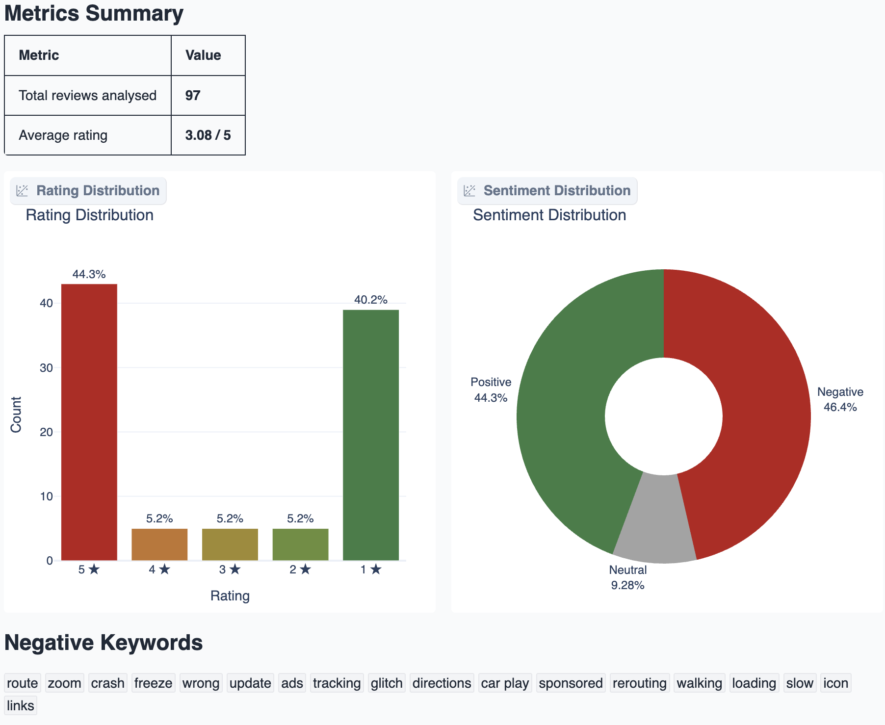
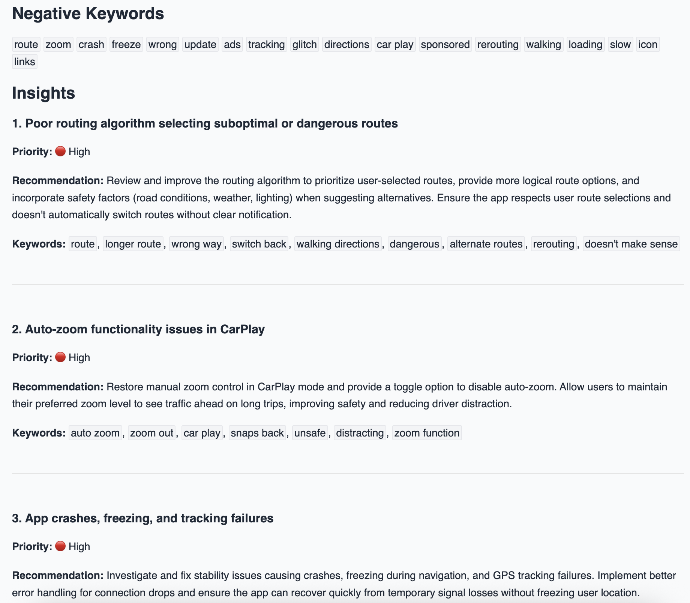

# Reviews Analyzer API

This is a REST API for analyzing app reviews from the Apple App Store.

## Features

- Scrape reviews from the Apple App Store
- Preprocess reviews
- Analyze reviews
- Get actionable insights from reviews

## Check it out!

UI to interact with the API is available at [https://huggingface.co/spaces/gerasymchukm/reviews-analyzer](https://huggingface.co/spaces/gerasymchukm/reviews-analyzer).
Google Cloud Run deployment is available at [https://reviews-analyzer-986693471676.europe-west1.run.app](https://reviews-analyzer-986693471676.europe-west1.run.app).

## Project structure

```
app/
├── api/routes.py          - endpoints
├── core/config.py, llm.py - settings & LLM provider factory
├── models/                - Pydantic schemas
└── services/              - scraper, preprocess, analyzer, metrics
```

## Installation

1. Install [uv](https://docs.astral.sh/uv/)
2. Clone the repository
3. Copy `.env.example` to `.env`
4. Configure `.env` - choose an LLM provider and supply the corresponding API key:

- `LLM_PROVIDER` - ollama, openai, anthropic, google. Default - ollama.
- `LLM_MODEL` - model name for the chosen provider. Default - `kimi-k2.5:cloud`.
- `OLLAMA_URL` - Ollama cloud API URL. Default - [https://ollama.com/v1](https://ollama.com/v1).
- `*_API_KEY` - API key for the selected provider.

Additional optional parameters:

- `MAX_CONCURRENCY` - Maximum number of concurrent requests to the LLM. Default - 5.
- `CHUNK_SIZE` - Number of reviews to process at once. Default - 5.
- `MAX_REVIEWS` - Maximum number of reviews to scrape. Default - 500.
- `SAMPLE_SIZE` - Number of reviews to sample. Default - 100.
- `DEFAULT_COUNTRY` - Two-letter country code for App Store region. Default - `us`.

5. Run the API:

```bash
uv sync
uv run uvicorn main:app
```

The API will be available at [http://localhost:8000](http://localhost:8000).

## API endpoints

All endpoints accept the same JSON request body:

```json
{
  "app_id": "6455785300",
  "country": "us",
  "max_reviews": 500,
  "sample_size": 100
}
```

Only `app_id` is required. Other fields use server defaults from `.env` if not provided.

### POST `/collect`

Returns unprocessed reviews.

Response:

```json
{
  "app_id": "6455785300",
  "total": 500,
  "reviews": [
    { "title": "Great app", "content": "Love using it daily", "rating": 5 }
  ]
}
```

### POST `/analyse`

Returns sentiment analysis, metrics and product insights.

Response:

```json
{
  "app_id": "6455785300",
  "metrics": {
    "total_reviews": 100,
    "average_rating": 3.5,
    "rating_distribution": [
      { "star": 1, "count": 20, "percentage": 20.0 },
      { "star": 5, "count": 35, "percentage": 35.0 }
    ],
    "sentiment_distribution": {
      "positive": 45,
      "neutral": 25,
      "negative": 30
    }
  },
  "insights": {
    "negative_keywords": ["crash", "slow", "battery"],
    "insights": [
      {
        "topic": "App crashes on startup",
        "priority": "high",
        "recommendation": "Investigate crash logs for cold-start scenarios",
        "keywords": ["crash", "startup", "freeze"]
      }
    ]
  }
}
```

### POST `/download`

Returns unprocessed reviews as a CSV file.

## Approach & Design Decisions

- **FastAPI** as the web framework — async support, automatic docs at `/docs`, and request validation via Pydantic models.
- **Pydantic** for all data models (request, response, review, metrics) — provides type safety, validation, and serialization.
- **Pydantic-ai** for LLM integration — two agents (sentiment classifier + insights analyst) with structured output that maps directly to Pydantic models, eliminating manual JSON parsing. Includes built-in retry logic.
- **Multi-provider LLM support** — factory pattern in `llm.py` supports OpenAI, Anthropic, Google, and Ollama. Switch provider via `.env` without code changes.
- **Data source** — Apple App Store reviews via the public iTunes RSS API (no authentication required). Pages are fetched concurrently with `httpx.AsyncClient`.
- **Preprocessing pipeline** — HTML unescape, unicode normalization, URL removal, duplicate filtering, and short review removal to reduce noise before sending to the LLM.
- **Two-stage LLM analysis** — first, sentiment is classified per review (chunked and processed in parallel via `asyncio.gather` with a concurrency limit). Then, all reviews with their sentiments are passed to the insights agent for thematic analysis.
- **LLM over traditional NLP** — classical sentiment libraries struggle with sarcasm, mixed-sentiment reviews, and context-dependent language common in app reviews. An LLM handles nuance better, and with pydantic-ai's structured output it returns typed results reliably. The trade-off is higher latency and cost, mitigated by sampling and chunked concurrent processing.

## Report Example

App ID: `585027354` - [Google Maps](https://apps.apple.com/us/app/google-maps/id585027354)



